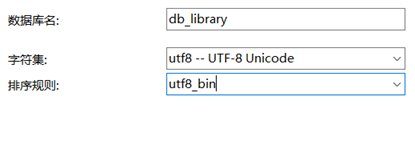
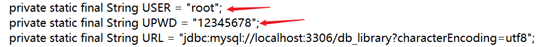
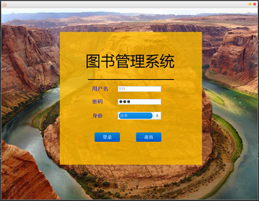
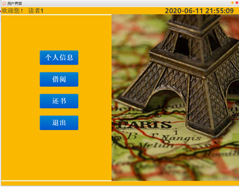
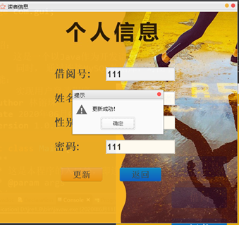

# 基于Java的图书管理系统

## 运行环境配置与使用说明

-   配置数据库信息：通过navicat等软件建立名为db_library的数据库，注意使用utf-8编码（如下图），然后导入源码文件夹里的db_library.sql文件到刚才建的数据库。

- 

-  修改数据库配置的类：将com.database这个包中的DatabaseConfig.java里面的数据库改为自己的信息。即如下操作：

- 

-  将程序代码放在已经Java的环境中，点击“运行”（程序入口在：src.com.gui.Main中）。随后会弹出程序运行界面，此时可以使用下面的测试用例进行测试：

- |         | 账号 | 密码 |
  | ------- | ---- | ---- |
  | 管理员  | 666  | 666  |
  | 读  者1 | 111  | 111  |
  | 读  者2 | 222  | 222  |

## 系统运行界面截图

- 

- 上图是登录的界面图，其中，身份选择采用的是下拉列表的方式，可以选择读者或者管理员进行登录。在代码中，表现在Login这个类中。

- 

- 上图是读者操作的界面，对应代码中ReaderMenu.java。当读者登录成功后，进入此界面。左上角是欢迎读者的提示，右上角则是显示的实时系统时间。中间的四个按钮，对应了四个读者操作权限。

- 

-  

  上图的读者个人信息界面图，对于代码ReaderMessage，读者点击 “个人信息”  按钮，可以查看个人信息，同时也可以修改个人信息，当修改完成后，点击“更新”，则会出现上图对话框弹出“更新成功“的提示。

